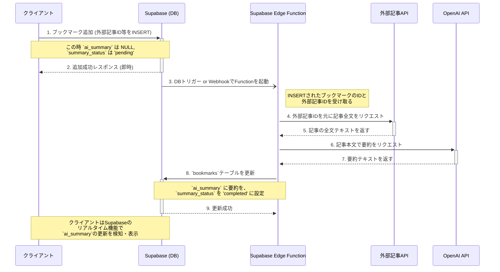

# AI要約生成ワークフロー仕様書

## 1. 機能概要

外部API経由で取得した記事のコンテンツを自動的に解析し、AI（OpenAI API）を利用して3〜5文程度の簡潔な要約を生成する。ユーザーが記事を選択して保存する際に、この要約が付与されることで、記事の要点を素早く把握できるよう支援する。

この機能は要件定義書の `F-003` に対応する。

---

## 2. アーキテクチャ

本ワークフローは、ユーザー操作と、完了までに時間がかかるAI処理を分離した**非同期アーキテクチャ**を採用する。

| コンポーネント | 利用技術/サービス | 役割 |
| :--- | :--- | :--- |
| **フロントエンド** | Next.js (React) | ユーザーからのブックマーク追加操作の受付。 |
| **バックエンド** | **Supabase Edge Functions** | 外部APIからの記事本文取得、AIへのリクエスト、DB更新など、一連のバックグラウンド処理を実行する。 |
| **データベース** | Supabase (PostgreSQL) | ブックマーク情報、生成された要約、処理ステータスを永続化する。 |
| **外部記事API** | （例: Hacker News API, Zenn APIなど） | 記事のメタデータおよび全文コンテンツを提供する。 |
| **AIモデル** | OpenAI API (GPT-4oなど) | 取得した記事本文から要約を生成する。 |

---

## 3. シーケンス図（処理フロー）



---

## 4. コンポーネント別詳細設計

### 4.1. 外部APIからの記事取得
- **リクエスト**: Edge Functionから `fetch` を使用して外部APIにリクエストを送信する。APIが認証を必要とする場合、APIキーはSupabaseのSecret Managerで管理し、環境変数経由でFunctionに渡す。
- **データ形式**: APIから返されるJSONオブジェクトから、記事の本文に相当するフィールドを抽出する。
- **課題**:
  - **レート制限**: 外部APIの利用規約を確認し、単位時間あたりのリクエスト数上限（レートリミット）を遵守する設計とする。必要に応じて、リクエスト間に待機時間（ウェイト）を入れる。
  - **API仕様変更**: 外部APIのレスポンス形式が変更される可能性を考慮し、データ抽出部分は疎結合に保ち、変更に強い構造にする。
- **タイムアウト**: 外部APIへのリクエストには、10〜15秒程度のタイムアウトを設定する。

### 4.2. AI要約 (プロンプトエンジニアリング)
- **モデル**: `gpt-4o` またはコストを考慮して `gpt-3.5-turbo` を利用する。
- **プロンプト**: 要約の品質を安定させるため、明確な指示を与える。
  ```
  あなたは優秀なテクニカルライターです。
  以下の記事本文を、ソフトウェア開発者が要点を素早く理解できるよう、3つの箇条書きで日本語で要約してください。
  記事で最も重要なキーワードや技術名は必ず含めてください。

  記事本文:
  """
  {article_text}
  """
  ```
- **文字数制限**: OpenAI APIのトークン数上限を超えないよう、入力する本文はAPIの仕様に合わせて制限する。

### 4.3. データベース (`bookmarks`テーブル)
- **処理状況の管理**: 堅牢な実装のために、以下のカラムを追加することを強く推奨する。
  - `summary_status` (enum: `'pending'`, `'processing'`, `'completed'`, `'failed'`): UIで「要約中...」などの表示を制御するために利用。
  - `summary_failed_reason` (text): 要約生成に失敗した場合（APIエラーなど）の理由を記録する。
- **外部IDの保存**: 外部記事APIで記事を一意に識別するためのIDを保存するカラム（例: `external_article_id`）が必要になる。

### 4.4. コストと利用制限
- **APIコスト**: OpenAI APIの利用は費用が発生する。要約1回あたりの平均トークン数を算出し、コストを見積もる。
- **無料プラン制限**: 要件 `F-010` に基づき、無料ユーザーの要約回数を制限する。
  - `users`テーブルに`monthly_summary_count` (integer)と`last_summary_at` (timestamptz)のようなカラムを追加し、月間の利用回数を管理する。
  - Edge Functionの処理開始時に、この回数を確認し、上限に達している場合は処理を中断する。

---

## 5. エラーハンドリング

| 発生ステップ | エラーケース | 対応策 |
| :--- | :--- | :--- |
| **4. 外部APIリクエスト** | ・APIが4xx/5xxエラーを返す<br>・リクエストがタイムアウトする<br>・記事本文が含まれていない | `bookmarks`テーブルの`summary_status`を`'failed'`に更新し、`summary_failed_reason`に理由（例: "Failed to fetch article from API"）を記録する。リトライは行わない。 |
| **6. AI要約リクエスト** | ・OpenAI APIがエラーを返す<br>・APIがタイムアウトする | `summary_status`を`'failed'`に更新し、理由（例: "OpenAI API error"）を記録する。サーバー側の問題である可能性を考慮し、1回だけリトライするなどの戦略も考えられる。 |
| **全般** | Edge Functionの実行時間上限（VercelのHobbyプランでは10秒など）を超過する | 処理を複数のFunctionに分割するか、タイムアウトの長いProプランのFunctionを利用する必要がある。初期実装では、単一Function内で処理を完結させ、タイムアウトした場合は失敗として記録する。 |
```