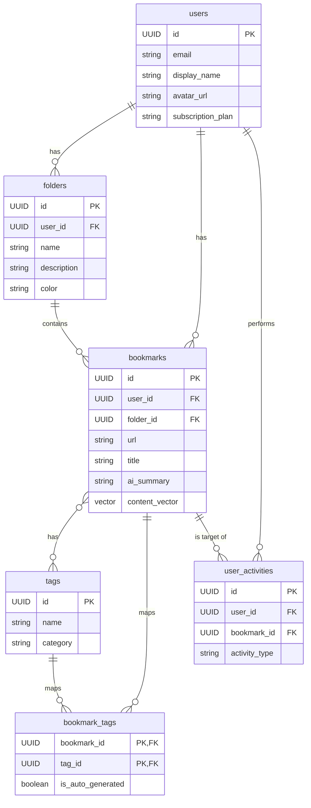
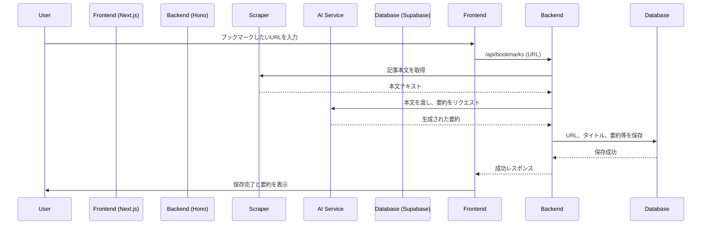

# アーキテクチャ設計書

## 1. 概要

本ドキュメントは、要件定義書で定められた機能および非機能要件を実現するためのシステムアーキテクチャ、技術スタック、データモデルについて記述する。

## 2. システム構成

### 2.1. 全体構成図

アプリケーションは、Next.jsによるフロントエンド、HonoによるバックエンドAPI、そしてSupabaseによるデータベース・認証基盤の3つの主要コンポーネントで構成される。AI機能は外部のLLMサービスを利用する。

```mermaid
graph TD
    subgraph "User Interface"
        A[Next.js App on Vercel]
    end

    subgraph "Backend Services"
        B[Hono API on Cloudflare Workers]
    end

    subgraph "Platform"
        C[Supabase]
        C1[PostgreSQL]
        C2[Auth]
        C3[Storage]
        C4[Vector DB]
        C --- C1 & C2 & C3 & C4
    end

    subgraph "External Services"
        D[AI Services <br/>(OpenAI/Claude)]
        E[Stripe]
        F[Resend]
    end

    A -- "API Request" --> B
    B -- "DB Query/Auth" --> C
    B -- "AI Processing" --> D
    A -- "Payment" --> E
    B -- "Email" --> F
```

### 2.2. コンポーネントの役割

- **Next.js App (Vercel):**
  - UI/UXの提供、状態管理、ユーザーインタラクションの処理。
  - サーバーサイドレンダリング(SSR)と静的サイト生成(SSG)による高速なページ表示。
  - VercelへのデプロイによるCI/CDとスケーラビリティの確保。

- **Hono API (Cloudflare Workers):**
  - ビジネスロジックの集約。
  - Supabaseとのデータ連携、AIサービスへのリクエストプロキシ。
  - Cloudflare Workers上で動作させることによる、低レイテンシ・高可用性の実現。

- **Supabase:**
  - **PostgreSQL:** メインのデータストア。
  - **Auth:** ユーザー認証（OAuth連携含む）。
  - **Storage:** OG画像などの静的アセットの保存。
  - **Vector (pg_vector):** 記事の埋め込みベクトルを保存し、セマンティック検索を実現。

## 3. 技術スタック

| 分類 | 技術 | 備考 |
| :--- | :--- | :--- |
| **フレームワーク** | Next.js 14+ (App Router) | フロントエンドと一部BFF |
| **言語** | TypeScript | 型安全性の確保 |
| **スタイリング** | Tailwind CSS + shadcn/ui | 効率的なUI構築 |
| **状態管理** | Zustand / React Context | シンプルで軽量な状態管理 |
| **APIフレームワーク**| Hono on Cloudflare Workers | 軽量・高速なエッジAPI |
| **データベース** | Supabase (PostgreSQL) | DB、認証、ストレージ |
| **決済** | Stripe | サブスクリプション管理 |
| **AI (要約/タグ付け)**| OpenAI API / Claude API | 高度な自然言語処理 |
| **メール配信** | Resend | トランザクションメール |
| **監視** | Sentry | エラートラッキング |
| **Webスクレイピング**| Cheerio / Playwright | 記事本文の取得 |


## 4. データベース設計 (Supabase)

### 4.1. ER図



### 4.2. RLS（Row Level Security）ポリシー

- **基本方針:** ユーザーは自身が作成したデータ（ブックマーク、フォルダ等）にのみアクセス可能とする。
- **ポリシー例 (`bookmarks`テーブル):**
  ```sql
  -- ユーザーは自分のブックマークのみ閲覧可能
  CREATE POLICY "Users can view their own bookmarks"
  ON bookmarks FOR SELECT
  USING (auth.uid() = user_id);

  -- ユーザーは自分のブックマークのみ作成可能
  CREATE POLICY "Users can insert their own bookmarks"
  ON bookmarks FOR INSERT
  WITH CHECK (auth.uid() = user_id);
  ```

## 5. 主要機能のシーケンス

### 5.1. AI要約付きブックマーク保存

